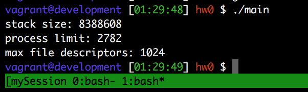

#user limits
## getrlimit/setrlimit使用
http://www.cnblogs.com/niocai/archive/2012/04/01/2428128.html

一个例子
http://www.go4expert.com/articles/getrlimit-setrlimit-control-resources-t27477/

```c
 #include <sys/resource.h> 
 #include <sys/time.h> 
 #include <unistd.h> 
 #include<stdio.h> 
  
 int main () 
 { 
   // Define and object of structure 
   // rlimit. 
   struct rlimit rl; 
  
   // First get the time limit on CPU 
   getrlimit (RLIMIT_CPU, &rl); 
  
   printf("\n Default value is : %lld\n", (long long int)rl.rlim_cur); 
  
   // Change the time limit 
   rl.rlim_cur = 1; 
  
   // Now call setrlimit() to set the  
   // changed value. 
   setrlimit (RLIMIT_CPU, &rl); 
  
   // Again get the limit and check 
   getrlimit (RLIMIT_CPU, &rl); 
  
   printf("\n Default value now is : %lld\n", (long long int)rl.rlim_cur); 
  
   // Simulate a long time consuming work 
   while (1); 
  
   return 0; 
 }
```
In the code above :
We first get the current limit on CPU time (since there is no limit to start off so the time limit should be -1)
Now after that we assign the value 1 as soft limit and call setrlimit() function to set this value as the new soft limit.
Again we get the value to cross check whether the new value is now active or not.
After that we get into an indefinite while loop to simulate a long work so that we can check whether or not our process is killed (Read RLIMIT_CPU above)


## 我的程序
```c
	#include <stdio.h>
	#include <sys/resource.h>

	int main() {
	    struct rlimit lim;
	//    setrlimit(RLIMIT_STACK, &lim);
	    lim.rlim_cur = RLIM_INFINITY;
	    setrlimit(RLIMIT_STACK, &lim);
	    getrlimit(RLIMIT_STACK, &lim);
	    printf("stack size: %ld\n", lim.rlim_cur);

	    lim.rlim_cur = 2782;
	    setrlimit(RLIMIT_AS, &lim);
	    getrlimit(RLIMIT_AS, &lim);
	    printf("process limit: %ld\n", lim.rlim_cur);

	    lim.rlim_cur = 1024;
	    setrlimit(RLIMIT_FSIZE, &lim);
	    getrlimit(RLIMIT_FSIZE, &lim);
	    printf("max file descriptors: %ld\n", lim.rlim_cur);
	    return 0;
	}
```

输出

