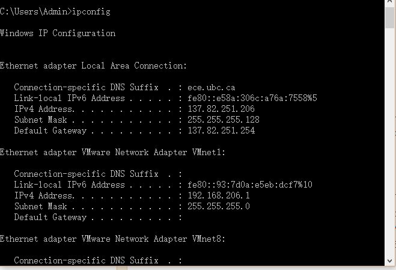
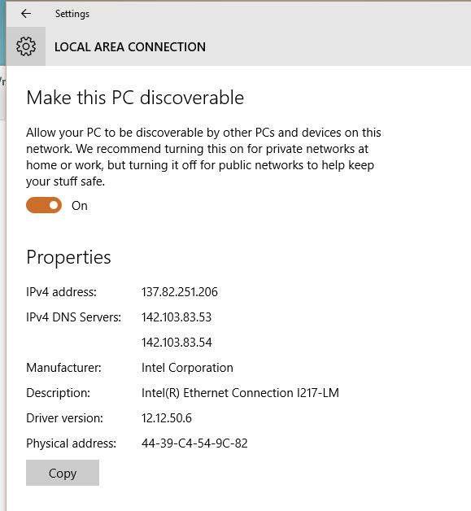
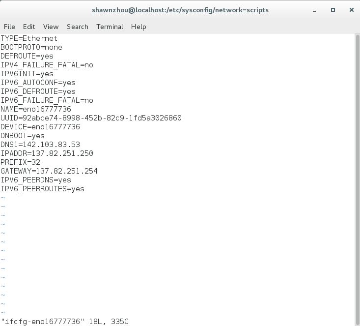

http://www.cnblogs.com/ggjucheng/archive/2012/08/19/2646007.html
http://www.centoscn.com/CentOS/config/2014/1112/4112.html

#桥接
iMOOC网推荐的方式，使用vmnet0

1. 该方式下，VM和主机平等，是地位相同的局域网中的两个机器，实际使用主机的物理网卡；故设置时要选择物理机使用的那个网卡（主机会有多个网卡）
2. 由于与物理主机在同一局域网，使用主机网卡，所以所有配置，除了IP外都要相同。例如，主机windows下为

则VM配置如下(CentOS下 可以 # nmtui命令进入；相当于RedHat #setup)
或者在文件中配置，需要改3个文件
/etc/sysconfig/network-scripts/ifcfg-enoXXXXXXXX      ----网络配置
/etc/sysconfig/network      -------hostname配置
/etc/resolv.conf      ------DNS

对比可知，除了IP不同但在同一网段，其它GATEWAY，DNS(nameserver)等都配置相同

当然VMware 软件中要配置
1. VM->Settings->Network Adapter: 选择Bridged
2. Edit-> Virtual Network Editor: (怎么VMnet0没了！？-> anyway VMnet0要设置成bridged，DHCP服务关掉)

#NAT
使用vmware,在Edit->Virtual Network Editor中配置好虚拟网络信息后看到下图所示，注意VMnet8，VMnet8相当于是本机的一个路由，虚拟机设置NAT后就通过这个路由进行上网的，可以查看其网络地址，路由地址，子网掩码。
选择VMnet8->NAT设置,可以看到子网ip显示为192.168.233.0，子网掩码是255.255.255.0，那路由地址呢，其实就是网关IP了，都是同个东西，这里是192.168.233.2。
接下来就好办了，在对应的虚拟机设置好ip，子网掩码，路由地址就可以上外网了，至于dns可以设置为8.8.8.8.

#Host-Only: 使用VMnet1

# 外网访问VM中的apache
外网访问VMware Workstation中通过NAT联网的虚拟机

http://www.cnblogs.com/devymex/p/4156378.html

# 外网链接内网 使用 花生壳
内网映射：针对无公网IP、无路由映射权限的内网用户使用，彻底解决NAT困扰